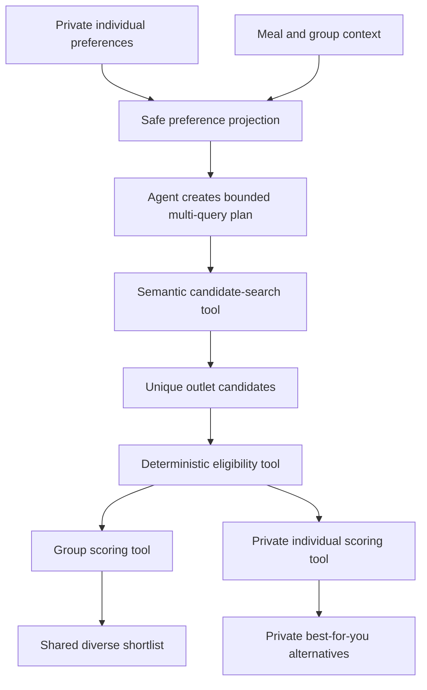

# Agent Retrieval and Personal Recommendation Tickets

These tickets extend the current deterministic recommendation system with
rights-aware semantic candidate retrieval. Embeddings improve candidate recall;
they do not replace structured eligibility, group fairness or evidence checks.

The intended pipeline is:



The agent decides which approved searches to run. Tool code controls source
rights, eligibility, scoring, privacy, fairness and publication.

## MAKAN-211 — Add rights-aware agent semantic retrieval

**Priority:** P1  
**Size:** XL  
**Type:** Agent, retrieval, catalog and evaluation  
**Related requirements:** REQ-04, REQ-05, REQ-09, REQ-11, REQ-14, REQ-18  
**Depends on:** An approved local restaurant corpus with current
`rights.embed = allowed`

### Problem

The current web application enumerates nearby outlets and performs transparent
structured matching. This is appropriate for a small catalog, but it cannot
reliably retrieve semantically related meals for multilingual or descriptive
requests such as “something warm, soupy and light.”

The original prototype contains Chroma-based semantic search, but that index is
not connected to the new group recommendation workflow. A naive global search
over menu-item vectors would also favour restaurants with large menus because
they receive more opportunities to appear.

### Outcome

Add a bounded agent tool that retrieves unique restaurant candidates using
semantic, keyword and structured matching. Retrieval may improve recall, but all
published candidates must still pass the existing deterministic eligibility and
group-scoring tools.

### Scope

1. Create a catalog-versioned embedding index for approved restaurant and menu
   records.
2. Support multiple retrieval queries per run:
   - one safe taste query per included diner;
   - one group-overlap query;
   - an optional exploration query when requested.
3. Combine semantic retrieval, keyword retrieval and structured ontology matches.
4. Deduplicate menu matches by `outlet_id` before candidate scoring.
5. Return only a bounded number of representative menu items for each outlet.
6. Pass retrieved outlet IDs into the existing hard-eligibility pipeline.
7. Record catalog, embedding-model, index and retrieval-policy versions.
8. Fall back to the current structured retrieval path when the vector index is
   missing, stale or unavailable.

### Non-goals

- Embedding allergies, diagnoses, dietary requirements or precise private
  locations.
- Using similarity as proof of price, ingredients, dietary suitability,
  accessibility, certification, opening hours or availability.
- Letting the model query the database or vector store without a bounded tool.
- Mixing recipes and restaurant menu records in the same index.
- Replacing the deterministic group-fit formula with an LLM score.

### Safe preference projection

The model-visible projection may contain soft taste dimensions only:

```json
{
  "meal_ref": "meal-123",
  "members": [
    {
      "member_ref": "member-1",
      "taste": {
        "cuisines": ["Chinese"],
        "dish_families": ["noodle_soup"],
        "flavour_tags": ["light"],
        "appetite": "light",
        "novelty": "familiar"
      }
    }
  ],
  "group": {
    "shared_cuisines": ["Chinese", "Malaysian"],
    "budget_band": "RM20-RM35",
    "occasion_features": ["quiet", "casual"]
  }
}
```

Firm requirements remain behind `meal_ref` and are evaluated by deterministic
tools. Member references must be opaque and scoped to the current run.

### Tool contract

Suggested tool name: `semantic_candidate_search`

```json
{
  "meal_ref": "meal-123",
  "queries": [
    {
      "query_id": "member-1",
      "text": "light mild noodle soup",
      "top_k": 20
    },
    {
      "query_id": "member-2",
      "text": "Malaysian rice and noodle meal",
      "top_k": 20
    },
    {
      "query_id": "group-overlap",
      "text": "affordable casual Asian meal",
      "top_k": 30
    }
  ],
  "filters": {
    "radius_km": 5,
    "meal_roles": ["main", "set"],
    "channel": "dine_in",
    "review_status": "reviewed",
    "evidence_current": true
  },
  "maximum_outlets": 30,
  "maximum_items_per_outlet": 3
}
```

The result should contain opaque candidate IDs, representative item IDs,
allowlisted retrieval reason codes and structural receipts. It must not claim
that a candidate is eligible.

### Outlet aggregation

Menu size must not increase an outlet's score by giving it more vectors. Use a
bounded aggregation such as:

```text
outlet_semantic_score = mean(top 2 menu-item similarities for the outlet)
```

Do not sum all menu-item similarities. Enforce a per-outlet item cap before
fusion and ranking.

One initial hybrid retrieval formula may be:

```text
candidate_recall_score
    = 0.55 × semantic_outlet_score
    + 0.30 × structured_tag_match
    + 0.15 × keyword_match
```

The exact weights are a versioned retrieval hypothesis and require evaluation.
Reciprocal-rank fusion is also acceptable if it performs better on the declared
judgment set.

### Recipe retrieval boundary

If recipe embeddings are used, keep them in a separate index:

```text
craving
  → recipe/dish concept retrieval
  → allowlisted dish and flavour concepts
  → restaurant-menu retrieval
  → actual menu evidence
```

A recipe match can help interpret a craving. It cannot establish that a
restaurant sells the dish.

### Agent limits

- One safe preference-projection call.
- At most three semantic-search calls per recommendation attempt.
- Maximum query length and fixed top-k bounds.
- One eligibility call for the resulting candidate batch.
- One deterministic group-scoring call.
- No arbitrary vector-store filters supplied by the model.
- No raw vector-store documents returned to the model.
- Provider failure produces a structured fallback receipt.

### Source-rights and index lifecycle

- Index only records whose current source evidence permits embedding.
- Treat `rights.display` and `rights.embed` independently.
- Exclude expired, prohibited and unknown embedding rights.
- Identify every index using catalog version, embedding model and index-policy
  version.
- Refuse an index whose catalog version differs from the active catalog.
- Remove or replace stale vectors when records change.
- Do not log source text, user query text or vectors in operations output.

### Privacy and security

- Do not embed allergies, medical information, precise origins, email addresses,
  feedback text or credentials.
- Sanitize optional craving text before creating a query.
- Reject contact details, secrets, precise coordinates and possible dietary or
  medical requirements from model-generated retrieval text.
- Treat restaurant and menu text as untrusted data, never instructions.
- Keep complete query text out of shared responses and structural traces.

### Evaluation

Create a versioned multilingual retrieval judgment set containing:

- English queries;
- Bahasa Melayu queries;
- mixed-language queries;
- synonyms and spelling variants;
- broad cravings;
- specific dish families;
- flavour descriptions;
- large-menu and small-menu restaurants;
- duplicate dishes and chain branches;
- queries with no supported match.

Measure:

- outlet recall at 10 and 30;
- normalized discounted cumulative gain;
- unique-outlet ratio;
- maximum share belonging to one outlet or brand;
- large-menu versus small-menu exposure;
- fallback rate;
- latency;
- index freshness failures;
- retrieval contribution to final accepted recommendations.

### Acceptance criteria

1. Only current records with `rights.embed = allowed` enter the index.
2. Restaurant and recipe indexes are separate.
3. Each retrieval result contains unique outlet candidates with no more than the
   configured number of representative items.
4. Adding duplicate menu items does not improve an outlet's semantic score.
5. A large menu cannot occupy the complete candidate set.
6. Semantic retrieval cannot bypass any existing hard eligibility check.
7. Missing or unavailable embeddings fall back to structured retrieval.
8. The same catalog, model, policy and input produce deterministic aggregation.
9. Private or sensitive sentinel values never enter the index, model request,
   trace or shared response.
10. Deleted or superseded catalog records cannot be retrieved.
11. English, Bahasa Melayu and mixed-language judgments are reported separately.
12. Recommendation explanations describe supported menu matches without treating
    vector similarity as factual evidence.

### Required tests

- Source-rights and expiry filtering.
- Index/catalog version mismatch.
- Per-outlet menu-item cap.
- Duplicate menu-item invariance.
- Large-menu dominance regression.
- Hybrid fusion determinism.
- Multilingual retrieval fixtures.
- Sensitive-text rejection.
- Prompt-injection content treated as data.
- Stale-record removal.
- Vector-provider failure fallback.
- Full retrieval → eligibility → scoring integration.

### Definition of done

- Retrieval tool and versioned index contract are implemented.
- Current structured retrieval remains a tested fallback.
- Evaluation report is generated from fictional or approved data.
- Backend, privacy and browser status tests pass.
- README, catalog documentation and PRD acceptance matrix are updated.
- No real source is embedded without recorded permission.

## MAKAN-212 — Return private personal alternatives from the group-eligible pool

**Priority:** P1  
**Size:** L  
**Type:** Agent, ranking, privacy and post-decision workflow  
**Related requirements:** REQ-04, REQ-06, REQ-07, REQ-11, REQ-12, REQ-18  
**Depends on:** MAKAN-211 and the existing deterministic group-eligibility checks

### Problem

The shared shortlist optimizes the group's fit and fairness. It may not be the
highest-scoring meal for each individual diner. A diner should receive a private
alternative they can keep as a backup or choose if they decide not to follow the
group plan.

The private recommendation must not introduce an option that failed the current
group's hard eligibility checks. It must also identify a specific menu item that
is individually eligible for that diner.

### Outcome

For every included diner, generate an owner-scoped ranked list from the current
group-eligible candidate pool. Lead with one “Best fit for you” result and retain
up to two additional private alternatives.

Formally:

```text
group_eligible_pool
    = outlets that passed the current group's hard requirements

personal_best(member)
    = argmax personal_score(member, outlet, menu_item)

subject to:
    outlet ∈ group_eligible_pool
    menu_item is eligible for that member
```

### Scope

1. Extend scoring so it produces:
   - the shared group shortlist;
   - an owner-scoped personal ranking for each included diner.
2. Select a specific eligible menu item for every personal result.
3. Persist personal results by meal, user and meal revision.
4. Display a private “Best fit for you” card.
5. Support:
   - keep as backup;
   - choose separately;
   - dismiss;
   - view personal reason codes and menu evidence.
6. Connect a separate choice to feedback and learning for the place actually
   visited.
7. Mark personal results stale after any relevant context change.

### Non-goals

- Showing one diner's personal recommendation or score to another diner.
- Allowing a personal result to count as a group vote.
- Recommending an outlet outside the current group-eligible pool.
- Treating a saved backup as an actual visit.
- Learning a dislike for the group restaurant when the diner went elsewhere.

### Tool contract

Suggested tool name: `score_personal_options`

```json
{
  "meal_ref": "meal-123",
  "member_ref": "member-1",
  "eligible_candidate_ids": [
    "outlet-a",
    "outlet-b",
    "outlet-c"
  ],
  "maximum_results": 3,
  "scoring_version": "personal-fit-v1"
}
```

Example response:

```json
{
  "member_ref": "member-1",
  "options": [
    {
      "outlet_id": "outlet-b",
      "item_id": "item-b4",
      "score": 0.91,
      "eligibility_receipt": "eligible-720",
      "reason_codes": [
        "DISH_FAMILY_MATCH",
        "LIGHT_MEAL_MATCH",
        "WITHIN_COMFORT_BUDGET"
      ]
    }
  ]
}
```

The shared response must never include this owner-scoped object.

### Personal score

An initial versioned hypothesis may be:

```text
personal_score
    = 0.30 × semantic dish relevance
    + 0.25 × structured taste match
    + 0.15 × reviewed personal affinity
    + 0.10 × budget comfort
    + 0.10 × travel comfort
    + 0.10 × novelty preference
```

Hard requirements are gates and are never weighted preferences. Unknown travel,
quality or affinity evidence remains neutral.

The group fairness adjustment is not part of the personal score because the
candidate pool has already passed group eligibility. The group shortlist continues
to use the existing mean, member-floor and diversity rules.

### Persistence

Add an owner-scoped record equivalent to:

```sql
CREATE TABLE personal_recommendations (
  meal_id TEXT NOT NULL,
  user_id TEXT NOT NULL,
  meal_revision INTEGER NOT NULL,
  outlet_id TEXT NOT NULL,
  item_id TEXT NOT NULL,
  rank INTEGER NOT NULL,
  score REAL NOT NULL,
  scoring_version TEXT NOT NULL,
  retrieval_version TEXT NOT NULL,
  eligibility_receipt TEXT NOT NULL,
  reason_codes TEXT NOT NULL,
  status TEXT NOT NULL,
  created_at TEXT NOT NULL,
  updated_at TEXT NOT NULL,
  PRIMARY KEY (meal_id, user_id, meal_revision, rank)
);
```

Allowed statuses:

- `suggested`
- `saved_backup`
- `chosen_separately`
- `dismissed`
- `stale`

### Invalidation

Mark personal results stale when:

- meal revision changes;
- participant membership changes;
- the diner changes their response or profile;
- a firm requirement changes;
- catalog or evidence revision changes;
- route evidence changes or expires;
- embedding index changes;
- retrieval or scoring version changes;
- the diner is no longer included in the meal.

Never silently reuse a result from another revision.

### User interface

Show a private card such as:

> **Best fit for you**  
> Mild fish noodle soup at Restaurant B  
> Matches your light-meal preference and comfortable budget.

Actions:

- **Keep as my backup** — private; does not change the group vote.
- **Choose this instead** — records a private separate plan.
- **See other personal options** — reveals up to two additional results.
- **Why this fits me** — shows allowlisted reason codes.
- **View menu evidence** — shows the exact matching menu item and evidence.
- **Dismiss** — hides the recommendation for the current revision.

The card must state that it is private and does not change the group's choice.

### Group-decision behavior

#### Before final group selection

If a diner explicitly chooses to leave the group plan:

1. Confirm the consequence in the UI.
2. Mark that diner withdrawn from the shared decision denominator.
3. Increment the meal revision.
4. Invalidate the shortlist, votes, delegations and personal results.
5. Require generation and consent for the new participant set.

Saving a backup does none of these things.

#### After final group selection

If a diner chooses a personal alternative:

1. Preserve the historical shared group decision.
2. Record the private separate choice.
3. Do not rewrite other diners' decision history.
4. Send feedback to the restaurant and item actually visited.
5. Do not treat the group restaurant as visited, enjoyed or disliked by this diner.

### Privacy and security

- Scope every personal recommendation by authenticated `user_id` and `meal_id`.
- Return only the requesting diner's result in the ordinary meal view.
- Never expose personal scores in group acceptance counts or operations traces.
- Keep private reason codes out of other diners' responses.
- Avoid exposing a private origin through travel explanations.
- Export personal results only in the owner's data export.
- Delete or anonymize them according to account deletion and retention policy.

### Feedback and learning

- A saved backup produces no observation.
- A dismissed suggestion produces no negative taste observation unless the diner
  explicitly supplies a reason for learning and reviews it.
- `chosen_separately` becomes an observation only after actual-visit confirmation.
- Feedback attaches to the actual outlet and item.
- Choosing separately must not create a dislike observation for the group choice.
- Attribute-specific feedback continues to update only its supported dimension.

### Acceptance criteria

1. Every included diner can receive up to three private personal results.
2. Every personal outlet comes from the current group-eligible pool.
3. Every suggested menu item independently satisfies that diner’s firm checks.
4. A restaurant cannot be recommended because an unrelated item matched the
   embedding query.
5. Other diners cannot access another member's options, scores or reason codes.
6. Saving a backup does not change votes, participant count or group decision.
7. Choosing separately before final selection changes the denominator and
   invalidates the current shortlist.
8. Choosing separately after final selection preserves the shared decision.
9. Feedback and learning attach only to the place actually visited.
10. No personal result is returned when no eligible menu item exists.
11. Stale personal results cannot be saved or chosen.
12. Embedding failure falls back to structured personal scoring.
13. Account export and deletion cover all personal recommendation records.
14. Shared traces and responses contain no private personal ranking.

### Required tests

- Personal result ownership and cross-user denial.
- Membership and room isolation.
- Group-eligible pool enforcement.
- Specific-menu-item eligibility.
- No result when only unrelated menu items match.
- Personal ranking determinism.
- Structured fallback without embeddings.
- Backup does not alter group state.
- Pre-decision separate choice invalidates the shortlist.
- Post-decision separate choice preserves group history.
- Stale revision rejection.
- Catalog and route evidence invalidation.
- Actual-visit feedback linkage.
- No false dislike for the group restaurant.
- Export, deletion and retention coverage.
- Desktop, narrow-mobile and WebKit private-card journeys.

### Definition of done

- Personal scoring tool is versioned and deterministic.
- Personal recommendations are persisted and owner-scoped.
- Group and personal outputs are separate projections.
- Backup and separate-choice workflows are implemented.
- Feedback and learning use the actual visit.
- Backend, privacy, browser and lifecycle tests pass.
- README, PRD acceptance, data model and operations documentation are updated.

## Implementation order

1. Establish an approved embedding corpus and multilingual judgment set.
2. Implement MAKAN-211 with structured fallback.
3. Evaluate outlet recall and menu-size concentration.
4. Implement the owner-scoped scoring and persistence portion of MAKAN-212.
5. Add backup and separate-choice lifecycle behavior.
6. Add feedback linkage, browser coverage and documentation.

Neither ticket is accepted solely because embeddings return plausible results.
Publication still requires deterministic evidence, eligibility and revision checks.
